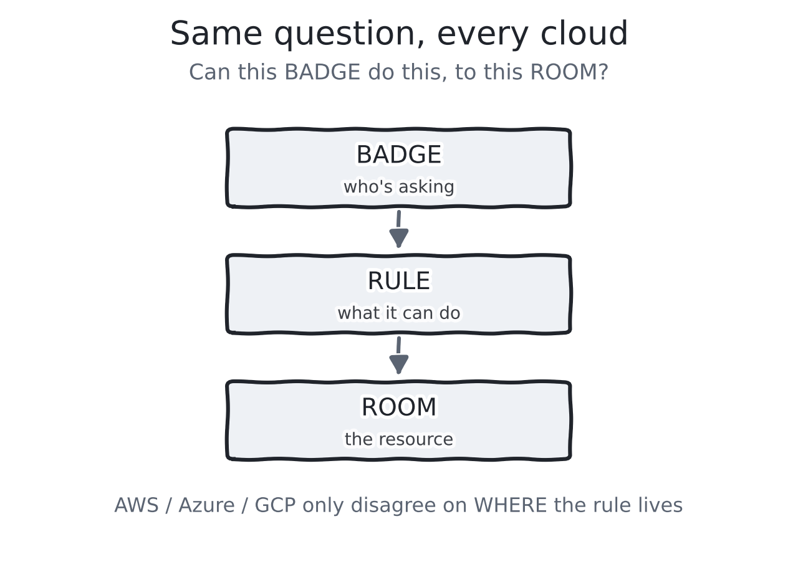
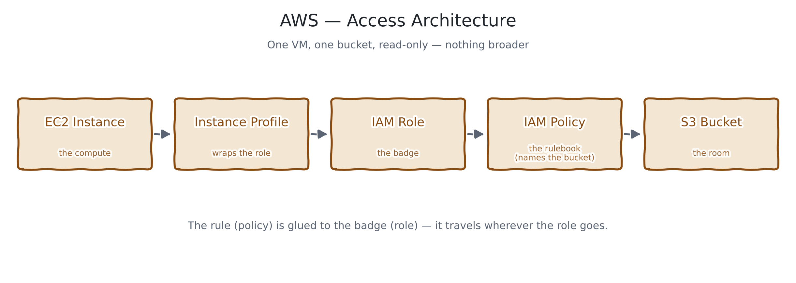
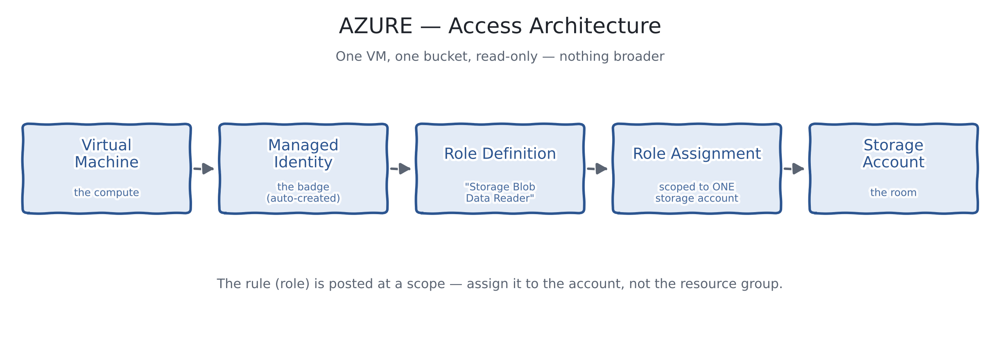
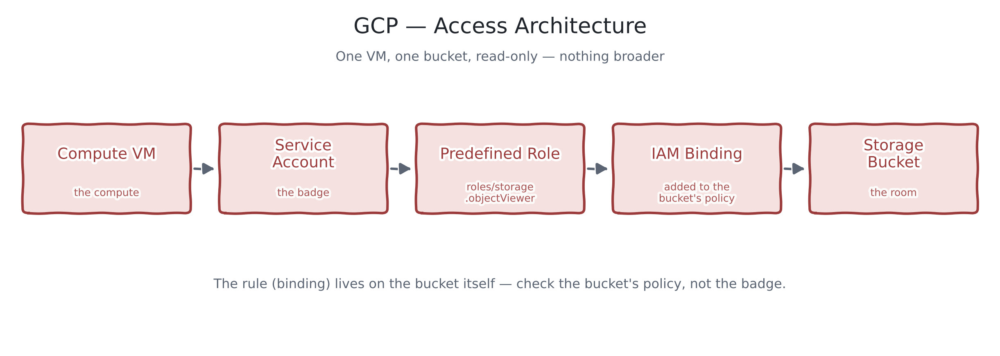

# IAM vs Azure RBAC vs GCP IAM — Quick Comparison

*Day 1 of the Cloud Trio Challenge — AWS vs Azure vs GCP, one topic at a time.*

> Publishing to Medium? Upload the images from `diagrams/` yourself at each spot below — Medium can't pull them from a repo path.

## 1. What each cloud calls it (current names, 2026)

| | AWS | Azure | GCP |
|---|---|---|---|
| Identity store | IAM | Microsoft Entra ID *(renamed from Azure AD)* | Google Cloud identities |
| Authorization system | IAM policies | Azure RBAC | IAM |
| Workload identity | IAM Role | Managed Identity | Service Account |
| Multi-account access | IAM Identity Center | Entra ID (multi-tenant) | Resource Manager (org/folder/project) |

## 2. The one idea behind all three

- Every cloud checks: **can this badge do this, to this resource?**
- **AWS** — the rule is glued to the badge (attached to the role/user).
- **Azure** — the rule is assigned at a scope (a spot in the hierarchy).
- **GCP** — the rule lives on the resource itself (a binding on it).

## 3. Core concepts, point by point

**AWS IAM**
- Identities: users, groups, roles.
- Rules: JSON policy documents (`Effect`, `Action`, `Resource`).
- Can attach rules to the identity *or* to the resource (bucket policy).
- An explicit `Deny` always wins, no matter what else allows it.

**Azure RBAC + Entra ID**
- Entra ID holds identities (users, groups, service principals, managed identities).
- RBAC assigns a **role** at a **scope**: Management Group → Subscription → Resource Group → Resource.
- Assignments are inherited downward — assign too high, and it leaks to everything below.
- Managed Identity = no password/secret to manage for a VM or app.

**GCP IAM**
- Hierarchy: Organization → Folder → Project → Resource.
- No separate "policy document" step — you bind a role directly to a resource's own policy.
- Service Account = GCP's version of a workload identity.
- Deny policies exist too, but are separate from the normal allow bindings.

## 4. Recent updates worth knowing (2025–2026)

- **AWS**: IAM Identity Center is now the standard way to manage access across multiple AWS accounts (replaces the old "AWS SSO" name).
- **Azure**: the Azure AD → Microsoft Entra ID rename is complete — expect "Entra ID" everywhere in docs and the portal now, not "Azure AD".
- **GCP**: Privileged Access Manager (PAM) added for just-in-time, time-boxed elevated access; IAM Deny policies keep expanding to cover more permission types.

## 5. One example, implemented on all three clouds

**The task:** let one VM read files from one storage bucket — and nothing else.

### AWS

- Chain: EC2 Instance → Instance Profile → IAM Role → IAM Policy → S3 Bucket
- The policy is glued to the role, and names the exact bucket ARN.
- Terraform: [`terraform/aws/main.tf`](../terraform/aws/main.tf)

### Azure

- Chain: Virtual Machine → Managed Identity → Role Definition → Role Assignment → Storage Account
- The role assignment is scoped to the one storage account, not the resource group.
- Terraform: [`terraform/azure/main.tf`](../terraform/azure/main.tf)

### GCP

- Chain: Compute VM → Service Account → Predefined Role → IAM Binding → Storage Bucket
- The binding is added directly to the bucket's own policy, not the project.
- Terraform: [`terraform/gcp/main.tf`](../terraform/gcp/main.tf)

Each Terraform file creates the storage resource, the identity, and the least-privilege rule — nothing extra.

## 6. Cheat sheet: biggest beginner mistake per cloud

- **AWS** — writing `"Resource": "*"` instead of naming the exact bucket ARN.
- **Azure** — scoping the role assignment to the whole resource group instead of the one resource.
- **GCP** — binding the role at the project level instead of on the one bucket.

## 7. Remember this one line per cloud

- **AWS**: the rule travels *with* the badge.
- **Azure**: the rule depends on *where* you assigned it.
- **GCP**: the rule lives *on* the resource, not the badge.

---

*Next — Day 2: Virtual Networking — AWS VPC vs Azure VNet vs GCP VPC.*
